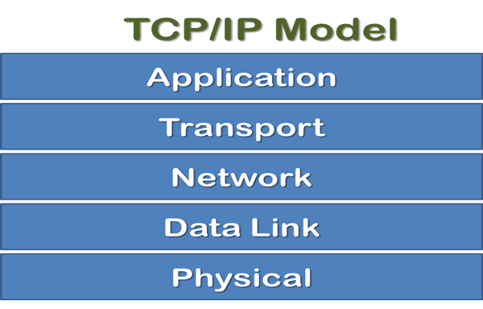

Name: Joelliane   
Student ID: 2802466322   
Class: B4CC   

# The World Wide Web (WWW)

The World Wide Web, often shortened to "the web," is a system of interconnected documents and resources accessed via the internet. It's built upon hypertext, allowing users to navigate between pages through links. Think of the internet as the roads, and the web as the traffic driving on them.

## Hypertext Transfer Protocol (HTTP)

HTTP is the foundation of data communication for the World Wide Web. It defines how messages are formatted and transmitted, enabling web browsers and servers to communicate. It's the language websites and browsers use to talk to each other.

## Domain Name System (DNS)

DNS is the phonebook of the internet. It translates human-readable domain names (like google.com) into IP addresses (like 172.217.160.142), which computers use to identify each other on the network. Without DNS, we'd have to remember long strings of numbers to visit websites!

## Internet Protocol (IP)

IP is the primary protocol for addressing and routing packets across the internet. Each device connected to the internet is assigned a unique IP address, ensuring data reaches the correct destination. Think of it like your postal address, ensuring your mail gets to your home.

## TCP/IP Model

The TCP/IP model is a suite of networking protocols that govern how data is transmitted across the internet. It's comprised of four layers, each with specific responsibilities:

- **Application Layer**: Where network applications operate (e.g., HTTP, email).
- **Transport Layer**: Ensures reliable data delivery (e.g., TCP, UDP).
- **Network Layer**: Handles addressing and routing of data packets (IP).
- **Link Layer**: Handles physical transmission of data over the network medium.

